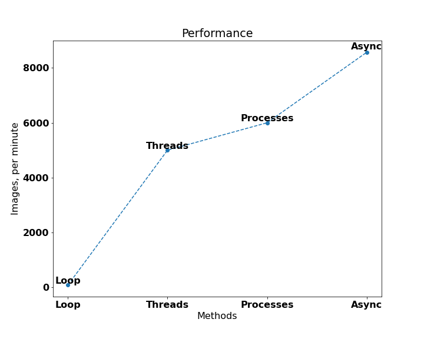

# Async Image Downloader

## 1. Introduction

Code for convenient asynchronous download of multiple images (thousands and millions) by their URLs. Also, for speed comparison, the code for downloading through the standard loop, multiprocessing and multithreading is presented.

## 2. Key features

* Different download methods with performance comparison
* Many options for different resizing and saving
* Сonvenient automatic saving to subfolders to avoid freezing
* Extensive logging

## 3. Usage

```bash
usage: image_downloader.py [-h] [--df DF] [--slice SLICE]
                           [--name_format {random,by_url,by_df}]
                           [--out_dir OUT_DIR]
                           [--mode {threads,processes,loop,async}]
                           [--folder_size FOLDER_SIZE]
                           [--folder_index FOLDER_INDEX]
                           [--response_timeout RESPONSE_TIMEOUT]
                           [--target_size TARGET_SIZE]
                           [--original_ratio ORIGINAL_RATIO]
                           [--skip_small SKIP_SMALL] [--quality QUALITY]
                           [--inter_timeouts INTER_TIMEOUTS] [--logs LOGS]

optional arguments:
  -h, --help            show this help message and exit
  --df DF               dataframe with image urls
  --slice SLICE         slice to limit size of dataframe
  --name_format {random,by_url,by_df}
                        format for the name of the downloaded images
  --out_dir OUT_DIR     folder for downloaded images
  --mode {threads,processes,loop,async}
                        mode for downloading
  --folder_size FOLDER_SIZE
                        max images in inner folder
  --folder_index FOLDER_INDEX
                        index of first inner folder for saving
  --response_timeout RESPONSE_TIMEOUT
                        timeout for response
  --target_size TARGET_SIZE
                        image size for saving process
  --original_ratio ORIGINAL_RATIO
                        keep the original aspect ratio of the image
  --skip_small SKIP_SMALL
                        skip images whose side < target_size
  --quality QUALITY     image quality for saving process
  --inter_timeouts INTER_TIMEOUTS
                        interval (like "(1, 4)") for sampling random timeout
                        after downloading each image
  --logs LOGS           log file
```

## Performance comparison

<p align="center">
    
</p>

## License

+ MIT License